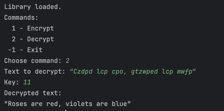

# Encrypt

# Decrypt

# Dynamic library

# (Extra) Static library

# Conclusions
### After completing this assignment I got the understanding of what are static and dynamic libraries, what are the differences between them and how to use them
